# ✈️ MojoLog — Zero-Knowledge Travel Vault & Itinerary Engine

**MojoLog** is an offline-first, high-performance travel workspace and itinerary engine built for modern explorers and couples. Designed with a **calm utility** philosophy, it combines local zero-knowledge encrypted vaults with physical analog metaphors — rendering air tickets as authentic **16:9 boarding passes**, accommodations as **4:3 smart key cards**, and route transit over the **TerraWay 2D vector map engine**.

---

## 📸 Client-Side UI & Feature Tour

### 1. Dual-Pane Itinerary Workspace & TerraWay Map
The central command center splits your daily schedule on the left with a responsive vector map on the right. Time-sequenced stops show estimated durations, drag-and-drop reordering, transit buffers (`36m · 10.8 km drive`), and attached travel notes.

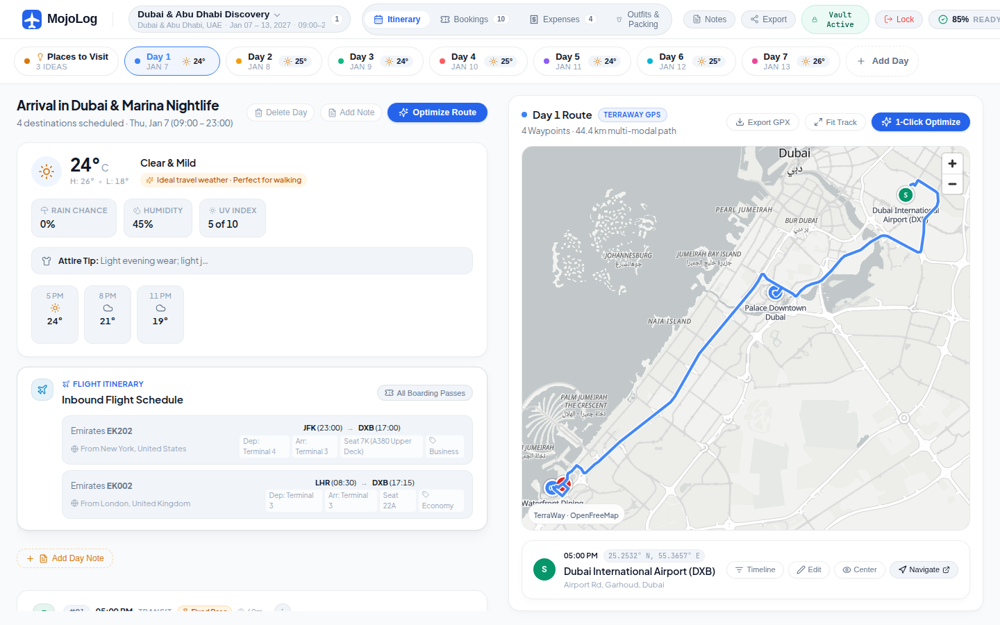

- **Horizontal Day Selector Strip:** Seamlessly toggle between itinerary days with live temperature forecasts and cultural dress code indicators, plus a dedicated **Places to Visit** backlog drawer for unassigned ideas.
- **TerraWay Vector Map:** Full MapLibre vector cartography supporting multi-modal routes (drive corridors, walking trails, nautical ferry fairways, and Great-Circle flight arcs).

---

### 2. Tactile Bookings & Document Vault
Say goodbye to messy email threads and PDF attachments. Bookings are transformed into tactile digital representations:

#### 16:9 Airline Boarding Passes
Flight reservations are presented in a classic 16:9 ticket format with real-time departure/arrival airport codes, local times, overnight `+1` day tags, an animated flight path, individual passenger tags (e.g. *John*, *Jane*), and a perforated tear-off stub containing flight number, PNR, and seat class.

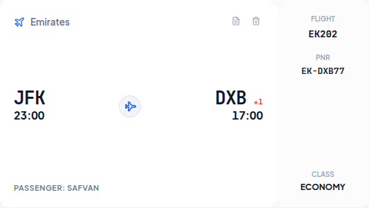

#### 4:3 Hotel Room Key Cards
Accommodations render as room key cards featuring deep gradient backdrops, a gold EMV smart chip graphic, a magnetic stripe, and reservation details.

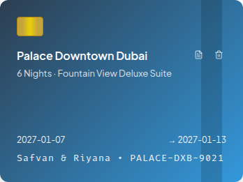

#### Unified Reservations Hub
Filter across all reservations by category (Hotels, Flights, Activities) with search indexing by booking reference, carrier, or venue.

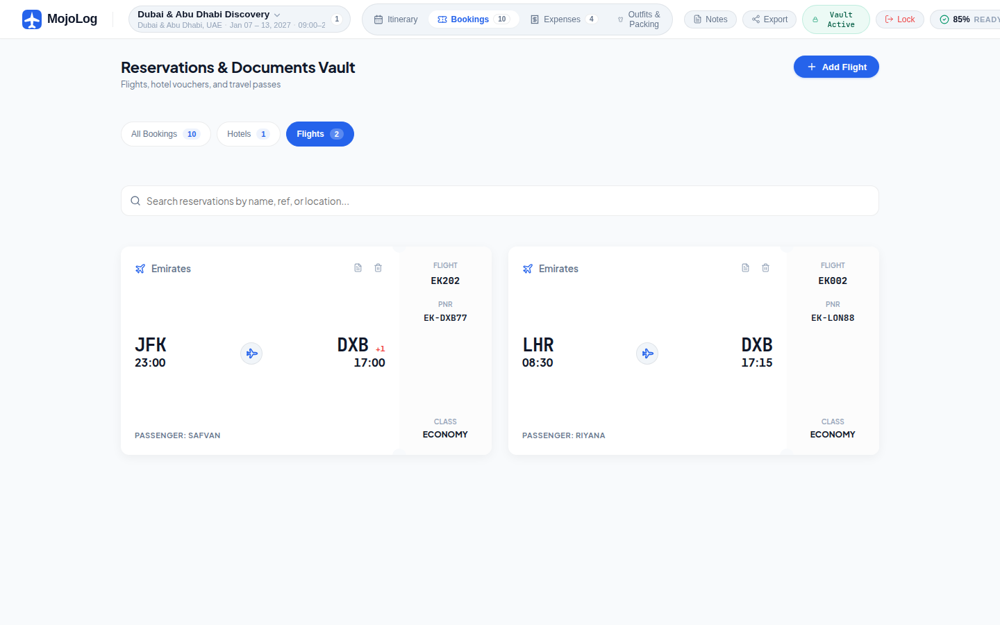

---

### 3. Multi-Currency Expense Tracker
Track spending with built-in offline currency conversion between your trip's local base currency (e.g., AED) and your home currency (e.g., USD).

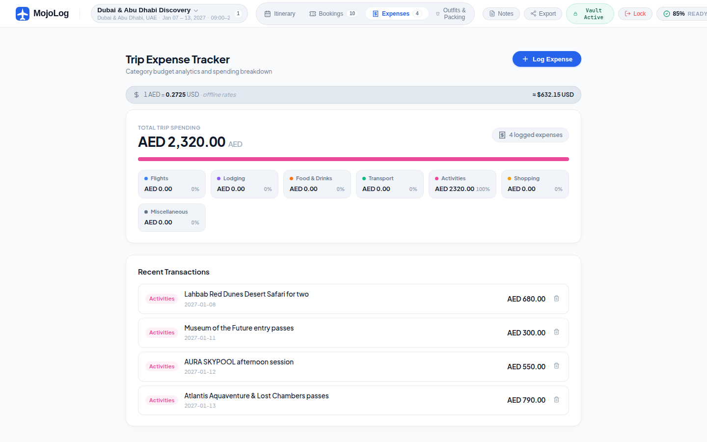

- **Category Budget Analytics:** Visual distribution across 7 standard travel categories (Flights, Lodging, Food, Transport, Activities, Shopping, Misc).
- **Recent Transactions Ledger:** Quick logging and chronological breakdown of expenses.

---

### 4. Couples Outfit Planner, Digital Wardrobe & Packing Hub
Prepare for your journey with weather-informed packing, a dedicated digital wardrobe closet, and smart outfit assignment.

#### A. Daily Itinerary Looks & Coordinated Styling
Day-by-day duo cards aligned with real-time temperature forecasts, cultural dress codes (e.g. mosque modesty reminders), occasion vibe pills (`☀️ Casual`, `🍷 Dining`, `🏖️ Beach & Pool`, `🕌 Cultural / Modest`), and 1-click wardrobe integration.

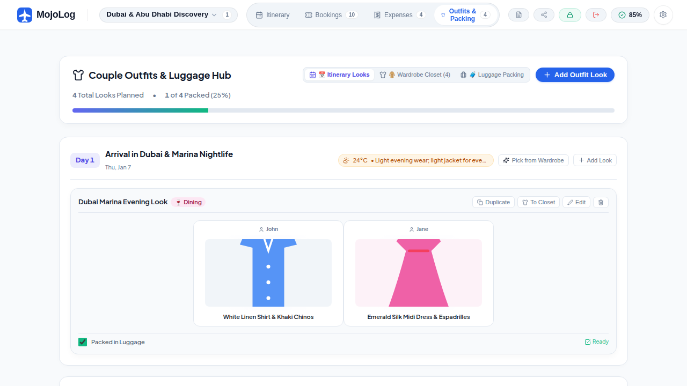

#### B. Digital Wardrobe Capsule Collection
Curate outfits in advance without tying them to specific dates. Browse your unassigned capsule wardrobe, filter by traveler (**John** & **Jane**) or occasion, toggle packing readiness, and assign looks to any day on the fly.

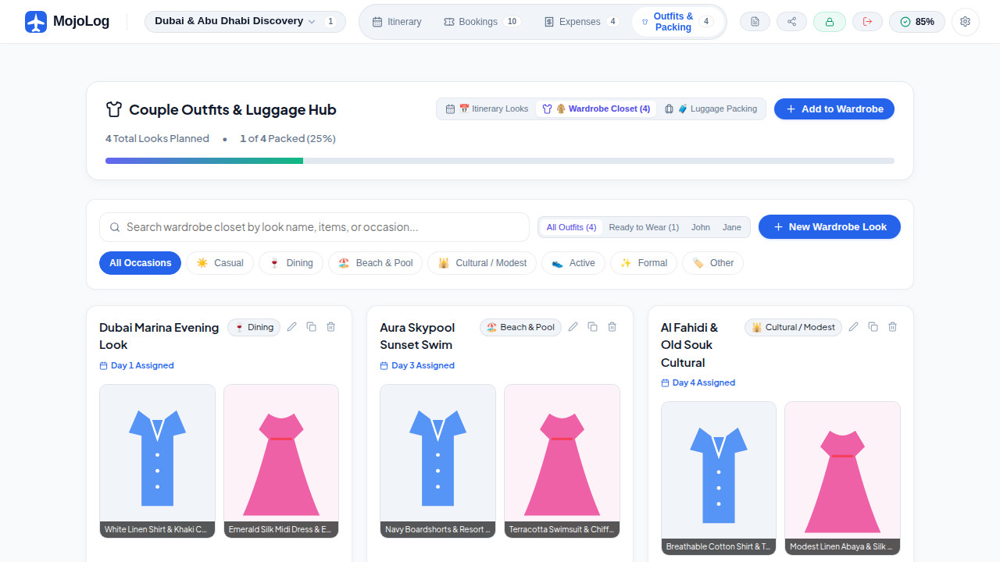

#### C. Pick from Wardrobe & Wear-Again Duplication
Assign already-created outfits to any day or specific place stop. Use **"Wear Again"** to duplicate favorite looks across multiple trip days while preserving item labels, photos, and packing states.

| Select from Wardrobe Modal | Outfit Creator with Occasion Vibes |
| :---: | :---: |
| 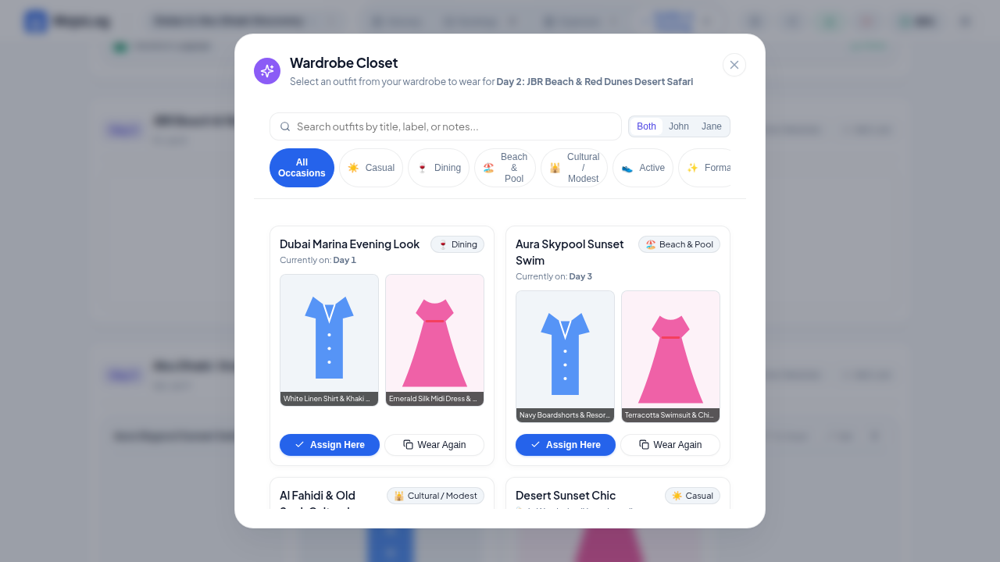 | 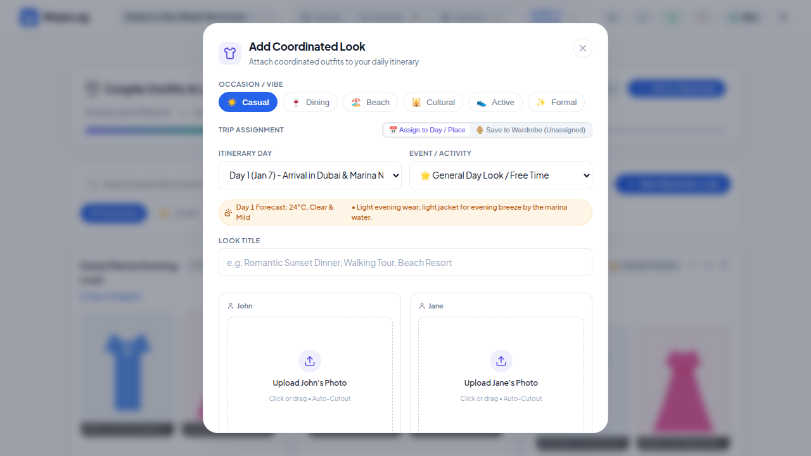 |
| *Browse saved looks with current day status, filtering, and 1-click 'Assign Here' or 'Wear Again' duplication.* | *Occasion vibe selector (Casual, Dining, Beach, Cultural, Formal) and 'Save to Wardrobe' toggle.* |

#### D. Luggage Packing Checklist Matrix
Interactive dual-traveler packing checklist with real-time completion percentages and category grouping.

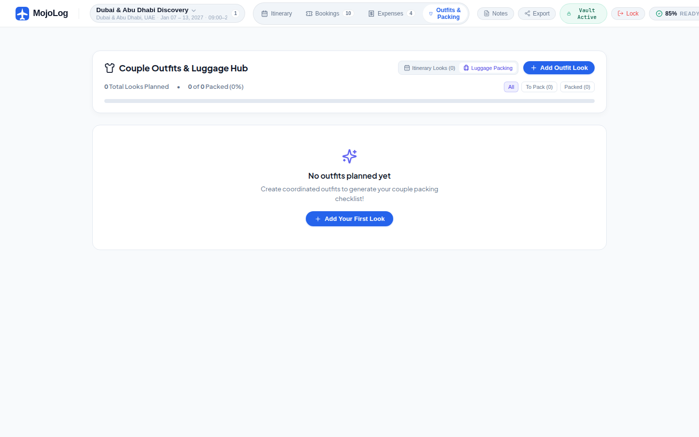

---

### 5. Smart Route Optimizer & Travel Readiness Audit

| 1-Click Route Optimizer (TSP 2-Opt) | Travel Readiness Audit |
| :---: | :---: |
| 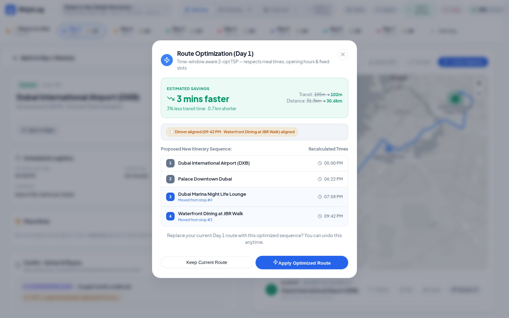 | 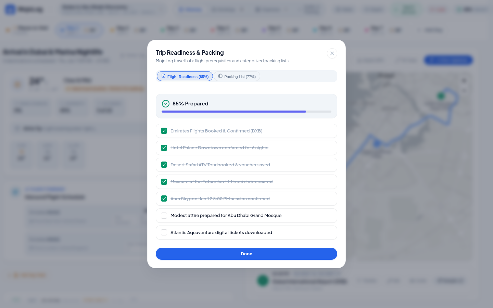 |
| *Automated route sequencing calculating minutes saved and mileage diff.* | *Readiness score auditing flight check-ins, insurance, and packing progress.* |

---

### 6. Personal Vault Journeys Catalog
Manage multiple itineraries in one secure, zero-knowledge vault with overview statistics (total journeys, calendar days, flights, and vouchers).

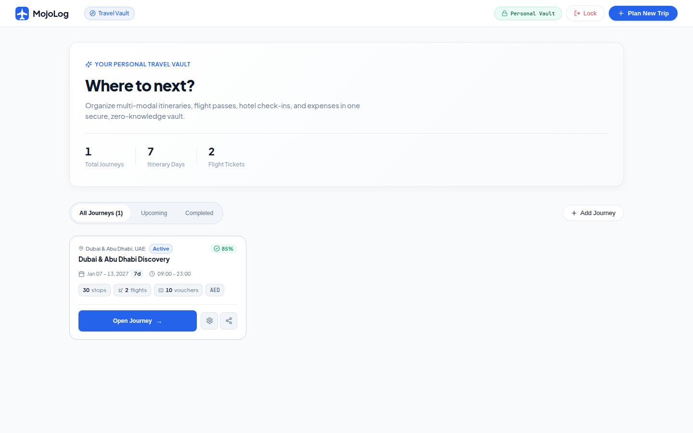

---

## 🔒 Security & Local-First Philosophy

- **Zero-Knowledge Encryption:** Data is encrypted locally before being stored in your browser's persistent storage.
- **Passcode Vault Gate:** One-click session lock (`Lock Vault & Log Out`) ensures your itineraries remain private when stepping away from your device.
- **100% Offline Capability:** Core routing, TSP optimization, distance calculations, and budget conversions execute entirely on the client side using pure TypeScript.

---

## 📦 Universal Export Options

- **Topografix GPX 1.1:** Export turn-by-turn waypoint tracks for Garmin, Apple Watch, or handheld GPS units.
- **RFC 5545 iCalendar (`.ics`):** One-click sync to Google Calendar, Apple Calendar, and Outlook.
- **Printable Travel Packet:** Automatically formats a high-density, printable emergency packet with consular contacts, hotel vouchers, and flight times for zero-battery scenarios.
- **Universal JSON Backup:** Complete portable backup of all trip assets.

---

## 🛠️ Development & Architecture

```bash
# Install dependencies
npm install

# Start local development server
npm run dev

# Build production artifacts (TypeScript + Vite)
npm run build

# Run unit and integration test suite
npm run test
```

### 📚 Documentation Links
- **[Design Reference Archive & Full Spec](./docs/design-reference/PROJECT_DESIGN_SPEC.md)** — Detailed component breakdown and screenshot index.
- **[Developer Documentation (DOCUMENTATION.md)](./DOCUMENTATION.md)** — Monorepo architecture, sync engine, and crypto primitives.
- **[Deployment Guide (DEPLOYMENT.md)](./DEPLOYMENT.md)** — Cloudflare Pages, Workers, and Turso setup.
- **[Roadmap & Tasks (TODO.md)](./TODO.md)** — Upcoming milestones and enhancements.
