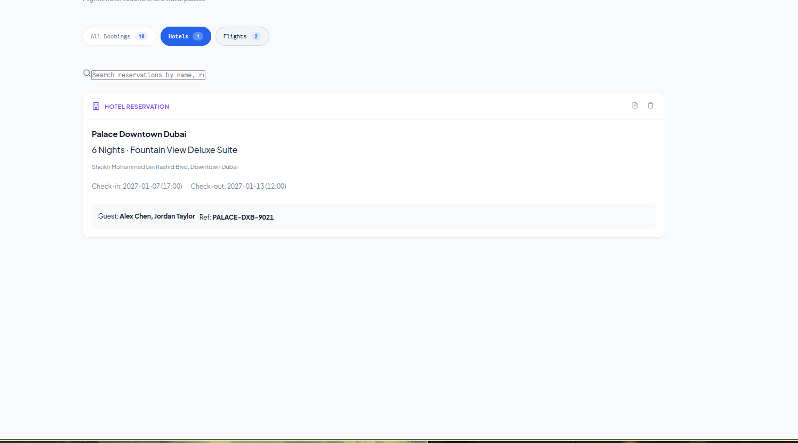
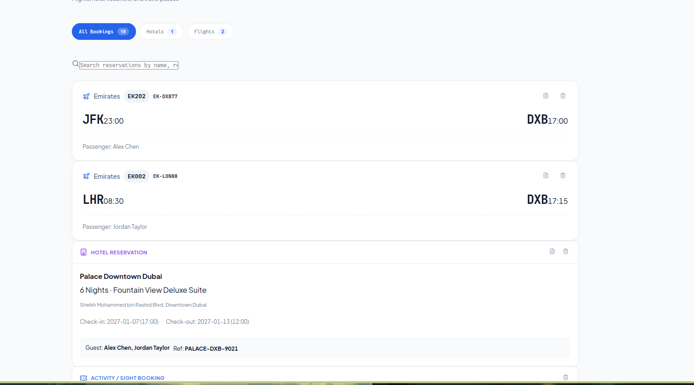

# ✈️ Roammate — Zero-Knowledge Travel Vault & Itinerary Engine

**Roammate** is an offline-first, high-performance travel workspace and itinerary engine built for modern explorers and couples. Designed with a **calm utility** philosophy, it combines local zero-knowledge encrypted vaults with physical analog metaphors — rendering air tickets as authentic **16:9 boarding passes**, accommodations as **4:3 smart key cards**, and route transit over the **TerraWay 2D vector map engine**.

---

## 📸 Client-Facing UI Showcase

### 1. Smart Autofill & Database Integrations
The itinerary builder natively integrates with Google Places, OSM, and Aviation Data. Instead of typing manual details, you simply search, and Roammate instantly resolves and populates coordinates, opening hours, ratings, and terminal gates directly into your vault.

| Place Search Autofill | Flight Data Resolution |
| :---: | :---: |
|  |  |

---

### 2. Dual-Pane Itinerary Workspace & TerraWay Vector Map
The central command center splits your daily schedule on the left with a responsive vector map on the right. Time-sequenced stops show estimated durations, drag-and-drop reordering, transit buffers (`36m · 10.8 km drive`), attached travel notes, and temperature dress code tags.


---

> 🎨 **Comprehensive Component & Design Reference:**  
> For the complete visual tour of all 35+ screens, modals, and drawers (including the **Digital Wardrobe Capsule**, **Multi-Currency Expense Tracker**, **Places to Visit Drawer**, **Route Optimizer**, and **Emergency Scratchpad**), explore:  
> - **[Design Reference Archive (`docs/design-reference/`)](./docs/design-reference/README.md)**  
> - **[Full Product Design Specification (`PROJECT_DESIGN_SPEC.md`)](./docs/design-reference/PROJECT_DESIGN_SPEC.md)**  
> - **[Couple Outfits & Wardrobe Showcase (`06-outfit-packing/`)](./docs/design-reference/06-outfit-packing/README.md)**  

---

## 🔒 Security & Local-First Philosophy

- **Zero-Knowledge Encryption:** Data is encrypted locally before being stored in your browser's persistent storage.
- **Passcode Vault Gate:** One-click session lock (`Lock Vault & Log Out`) ensures your itineraries remain private when stepping away from your device.
- **100% Offline Capability:** Core routing, TSP optimization, distance calculations, and budget conversions execute entirely on the client side using pure TypeScript.

---

## 📦 Universal Export Options

- **Topografix GPX 1.1:** Export turn-by-turn waypoint tracks for Garmin, Apple Watch, or handheld GPS units.
- **RFC 5545 iCalendar (`.ics`):** One-click sync to Google Calendar, Apple Calendar, and Outlook.
- **Printable Travel Packet:** Automatically formats a high-density, printable emergency packet with consular contacts, hotel vouchers, and flight times for zero-battery scenarios.
- **Universal JSON Backup:** Complete portable backup of all trip assets.

---

## 🛠️ Development & Architecture

```bash
# Install dependencies
npm install

# Start local development server
npm run dev

# Build production artifacts (TypeScript + Vite)
npm run build

# Run unit and integration test suite
npm run test
```

### 📚 Documentation Links
- **[Design Reference Archive & Full Spec](./docs/design-reference/PROJECT_DESIGN_SPEC.md)** — Detailed component breakdown and screenshot index.
- **[Developer Documentation (DOCUMENTATION.md)](./DOCUMENTATION.md)** — Monorepo architecture, sync engine, and crypto primitives.
- **[Deployment Guide (DEPLOYMENT.md)](./DEPLOYMENT.md)** — Cloudflare Pages, Workers, and Turso setup.
- **[Roadmap & Tasks (TODO.md)](./TODO.md)** — Upcoming milestones and enhancements.
