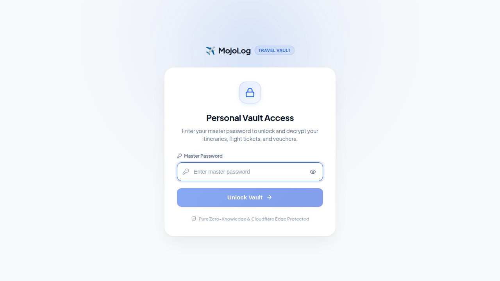

# 🔒 01. Personal Travel Vault Authentication Modal

This directory contains visual captures and specifications for the zero-knowledge master passcode authentication gate.

---

## 1. Master Passcode Gate (`passcode-auth-modal.png`)

Secures all personal travel itineraries, flight tickets, hotel vouchers, and financial logs. All data remains encrypted on the client side using AES-GCM until unlocked by the traveler.

### Key Features:
- **Branding & Iconography**: Minimalist brand mark with encrypted vault subtitle.
- **Master Password Input**: Secure input field with show/hide password toggle.
- **Zero-Knowledge Badge**: Visual confirmation that decryption occurs strictly on the client side.
- **Session Auto-Lock**: Seamlessly locks and clears session memory when logging out or after inactivity.
