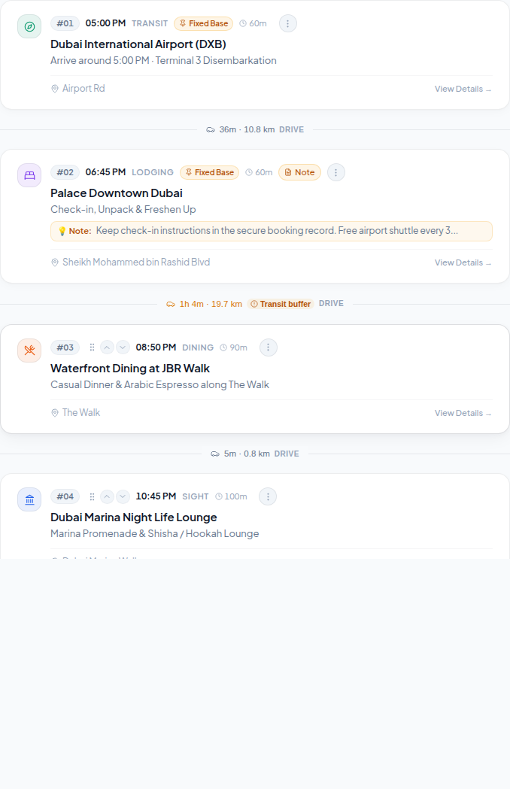

# 📅 03. Timeline Itinerary & Stop Cards

This directory contains visual captures and specifications for the dual-pane timeline stream, day selector strip, stop cards, and transit buffers.

---

## 1. Timeline Workspace Full View (`timeline-full-view.png`)

Split workspace presenting the chronological schedule on the left and the TerraWay vector map on the right.

---

## 2. Horizontal Day Selector Strip (`day-selector-strip.png`)

Sticky header navigation strip allowing seamless switching between trip days.

### Key Features:
- **Places to Visit Drawer**: Dedicated unassigned ideas bucket with item counter.
- **Day Tabs**: Chronological tabs with weekday, calendar date, and temperature forecast.

---

## 3. Timeline Cards & Multi-Modal Transit Buffers (`timeline-cards-detail.png`)

Cards for itinerary stops with dynamic transit calculations between locations.

### Key Features:
- **Stop Type Category Pills**: Color-coded category tags (`transit`, `lodging`, `dining`, `sight`).
- **Drag & Drop Handles**: Seamless stop reordering.
- **Fixed Base Locks**: Boundary pins for airport arrivals or night hotel bases.
- **Transit Buffer Indicators**: Real-time road distance and transit travel times (e.g. `36m · 10.8 km drive`).
- **Integrated Note Previews**: Collapsible callouts for confirmation codes, parking instructions, and travel tips.
