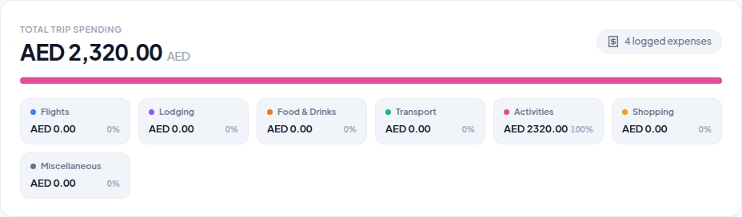
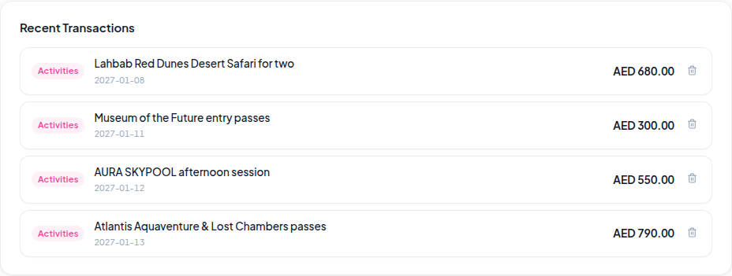
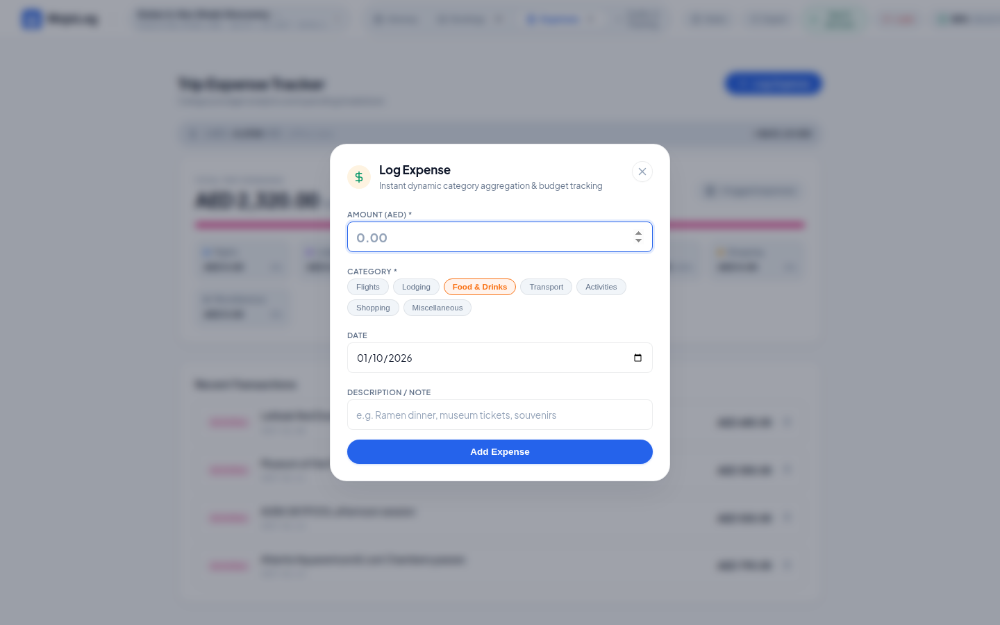

# 💰 05. Multi-Currency Expense Tracker

This directory contains visual captures and specifications for the financial dashboard, live currency rates, budget distribution, and transaction ledger.

---

## 1. Financial Overview Dashboard (`expense-tracker-overview.png`)

High-level summary displaying total spend, budget consumption, and live offline currency rates.

### Key Features:
- **Dual Currency Strip**: Real-time conversion between trip base currency (e.g. `AED`) and home currency (e.g. `USD`).
- **Offline Rate Fallback**: Pre-seeded currency tables allow conversions without internet connectivity.

---

## 2. Category Budget Analytics (`expense-breakdown-analytics.png`)

Visual breakdown across 7 primary travel categories.

### Key Categories:
1. ✈️ Flights
2. 🏨 Lodging
3. 🍽️ Food & Dining
4. 🚕 Transit
5. 🎟️ Activities
6. 🛍️ Shopping
7. 🏷️ Miscellaneous

---

## 3. Transactions Ledger & Entry Modal (`recent-transactions-list.png` & `log-expense-modal.png`)

| Transactions Ledger | Log Expense Modal |
| :---: | :---: |
|  |  |
