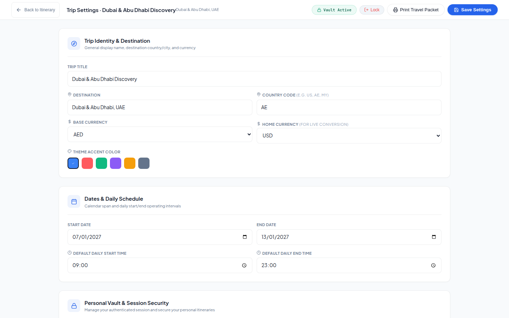
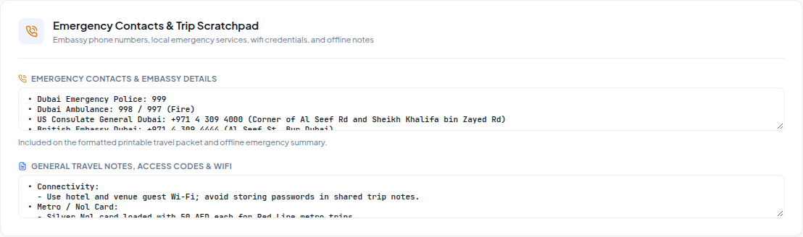

# ⚙️ 07. Trip Settings & Identity Configuration

This directory contains visual captures and specifications for trip identity, currencies, traveler names, theme swatches, and emergency contacts.

---

## 1. Trip Settings Dashboard (`trip-settings-viewport.png`)

Central configuration dashboard for travelers.

### Key Features:
- **Traveler Names Configuration**: Set personalized names for travelers (**John** and **Jane** by default).
- **Currencies & Destination**: Set base destination currency and home conversion currency.
- **Theme Accent Color Swatches**: Pick brand accent colors with live UI theme application.
- **Daily Operating Windows**: Define schedule start and end bounds (e.g. `09:00` to `23:00`).

---

## 2. Emergency Contacts & Consular Scratchpad (`emergency-contacts-scratchpad.png`)

Critical travel safety details accessible offline.

### Key Features:
- Embassy and consulate phone numbers and addresses.
- Local police, ambulance, and hospital emergency hotlines.
- Hotel concierge contact info and offline Wi-Fi access keys.
