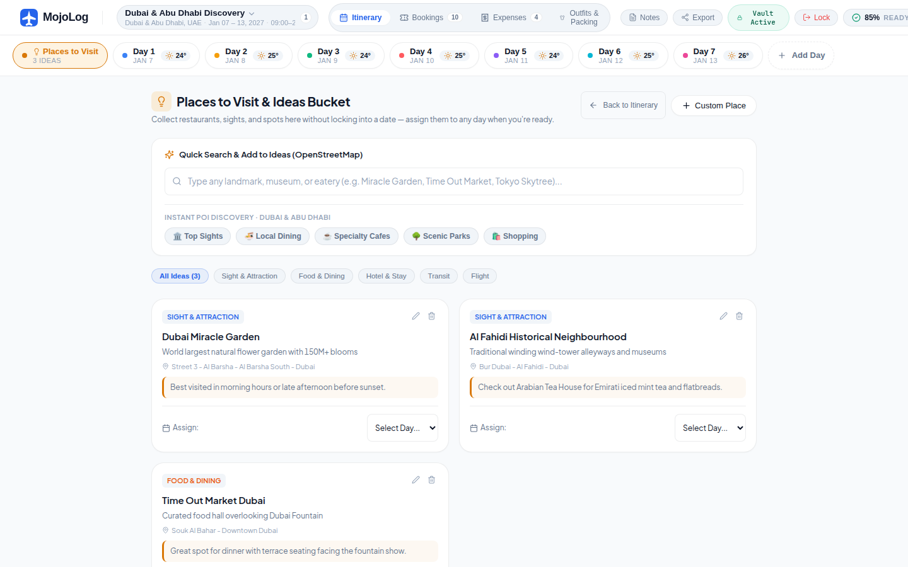
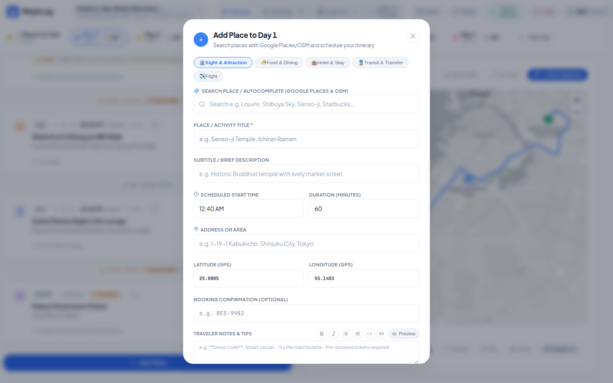
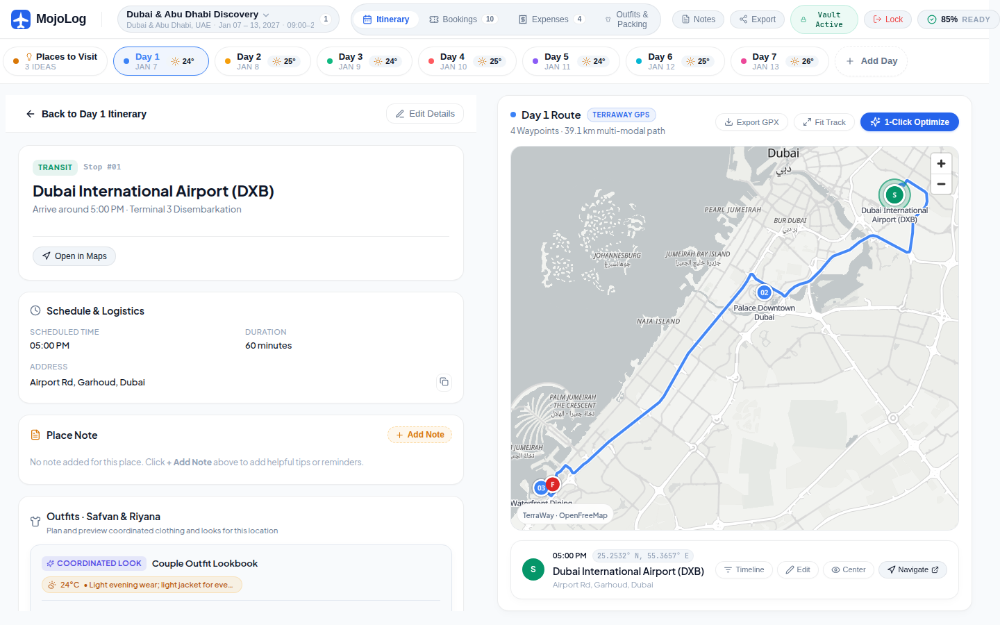
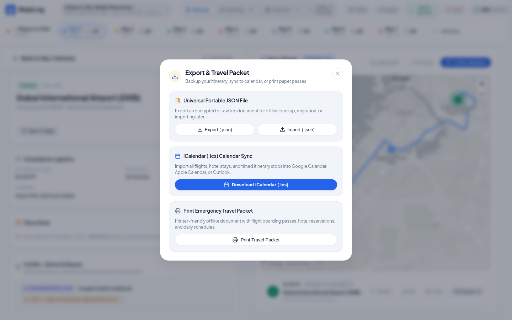

# 🗂️ 08. Modals, Drawers & Utilities

This directory contains visual captures and specifications for creation modals, inspection drawers, route optimizers, and export dialogues.

---

## 1. Places to Visit Drawer (`drawer-places-to-visit.png`)

Unassigned backlog drawer for attractions, dining spots, and recommendations.

---

## 2. Stop Creation & Inspection Modals

| Add Stop Modal (`modal-add-place-stop.png`) | Stop Detail Modal (`modal-stop-detail.png`) |
| :---: | :---: |
|  |  |

---

## 3. Route Optimizer & Travel Readiness Audit

| 1-Click TSP Route Optimizer (`modal-route-optimizer.png`) | Travel Readiness Audit (`modal-trip-readiness.png`) |
| :---: | :---: |
|  |  |

---

## 4. Universal Share & Export (`modal-share-export.png`)

Export formats for offline, mobile, and calendar synchronization:
- **GPX 1.1**: GPS track for smartwatches and navigation apps.
- **RFC 5545 iCal**: Direct calendar sync.
- **Printable Travel Packet**: Emergency physical print sheet.
- **Portable JSON**: Vault backup and transfer.

