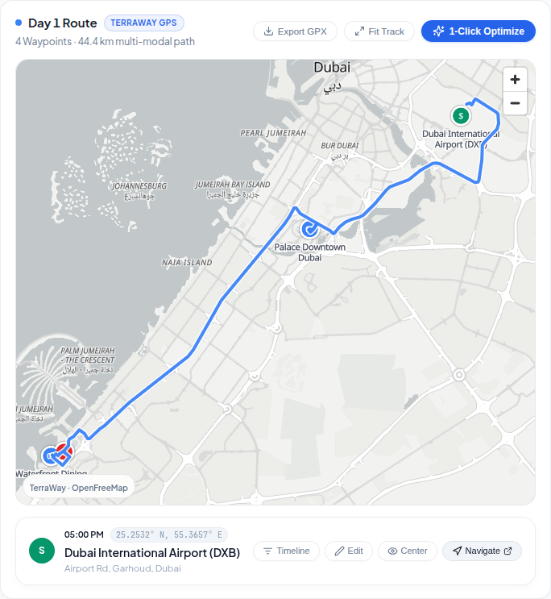

# 🗺️ 09. TerraWay Vector Map Engine

This directory contains visual captures and specifications for the TerraWay map panel, vector styles, and multi-modal routing.

---

## 1. TerraWay Map Panel (`terraway-map-panel.png`)

High-performance vector map engine powered by MapLibre GL.

### Key Features:
- **Calm Cartography**: Clean Positron vector tiles designed for high contrast and sunlight legibility.
- **Multi-Modal Routing Engine**:
  - Urban road driving routes with curved junction smoothing.
  - Great-Circle geodesic arcs for flights.
  - Nautical ferry fairway curves across bodies of water.
- **Waypoint Interaction**: Interactive stop pins with sequence numbers, category colors, and direct centering actions.
- **1-Click Track Fit & GPX Export**: Fast zooming to the full day's route bounds.
