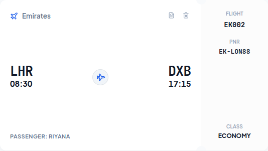
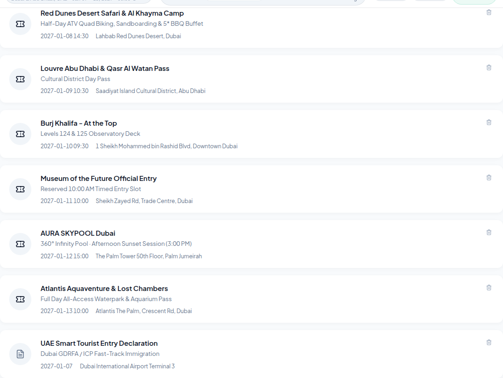

# Mojolog — Product & Design System Specification

> **Design Reference Archive**  
> All component screenshots are categorized in the sibling directories of `docs/design-reference/`.  
> Use this document and the visual captures as the definitive blueprint for creating the new design system.

---

## 1. Executive Summary & Product Vision

**Mojolog** is an offline-first, high-performance travel workspace and itinerary engine built for couples and modern explorers. Unlike bloated social travel apps, Mojolog operates as a **secure personal travel vault**:
- **Zero-knowledge & Local-first:** All trip data is stored in the traveler's encrypted local vault and seamlessly syncs to edge storage.
- **Physical Analog Metaphors:** Digital bookings are elevated through tactile metaphors — flights render as authentic **16:9 boarding passes**, hotel reservations present as **4:3 smart key cards**, and activities sit as **ticket stubs**.
- **Dense, Calm Utility:** Designed for travelers on the move in bright sunlight with poor connectivity — low cognitive load, legible typography, precise transit buffers, and offline GPS route planning.

---

## 2. Information Architecture & Navigation

```
App Shell (Header & Vault Status)
│
├── 1. Trips Catalog (trips_list)
│    ├── Journey Overview Cards (Dates, Days, Flights, Vouchers, Readiness Score)
│    └── New Trip Creation
│
├── 2. Trip Workspace (trip_detail)
│    ├── Header Toolbar: Trip switcher, Readiness badge (85%), Notes, Export, Vault Lock
│    │
│    ├── Tab A: Itinerary & Timeline
│    │    ├── Day Selector Strip (Days 1–7 + Ideas Bucket with weather & dates)
│    │    ├── Timeline Stream (Time-sequenced stops, buffer durations, transit pills)
│    │    ├── TerraWay Map Engine (Multi-modal road, track, and flight fairways)
│    │    └── Places to Visit Drawer (Backlog of unassigned ideas)
│    │
│    ├── Tab B: Bookings & Tickets Hub
│    │    ├── 16:9 Airline Boarding Passes (Flight paths, next-day badges, passenger tags)
│    │    ├── 4:3 Hotel Key Cards (Smart chip, magnetic stripe, check-in/out dates)
│    │    └── Horizontal Activity & Transit Passes (Quick reference list cards)
│    │
│    ├── Tab C: Expense Tracker
│    │    ├── Offline FX Conversion Bar (Base Currency vs Home Currency)
│    │    ├── Category Budget Breakdown (Flights, Lodging, Food, Transport, Activities)
│    │    └── Transaction Ledger & Log Expense Modal
│    │
│    └── Tab D: Outfits & Packing
│         ├── Day-by-Day Outfit Planner (Weather forecast, dress codes, morning/evening looks)
│         └── Luggage Packing Checklist (Category grouping, progress bar)
│
└── 3. Trip Settings (trip_settings)
     ├── Identity, Destination, Country Code & Currency configuration
     ├── Theme Accent Color Swatches
     ├── Daily Operational Windows (Default Start/End times)
     ├── Emergency Contacts & Consular Phone Numbers
     └── Universal JSON Export & Danger Zone
```

---

## 3. Component Inventory & Visual Reference

### 📁 `01-auth-modal/`
- **`passcode-auth-modal.png`**: The master password entry screen securing the zero-knowledge vault. Displays brand icon, secure master password field, show/hide toggle, and end-to-end edge encryption badge.


---

### 📁 `02-trips-list/`
- **`trips-list-overview.png`**: The primary landing view when browsing multiple journeys. Includes hero stats (Total Journeys, Itinerary Days, Flight Tickets) and filter pills (All, Upcoming, Completed).


- **`trip-card-detail.png`**: High-density journey card featuring destination pill, active status tag, dates, duration badge, readiness percentage ring, and quick-action buttons (Open Journey, Edit Settings, Export Backup).


---

### 📁 `03-timeline-itinerary/`
- **`timeline-full-view.png`**: Two-column layout with the day's chronological timeline on the left and the interactive map panel on the right.


- **`day-selector-strip.png`**: Horizontal tab bar showing "Places to Visit (ideas count)" followed by daily tabs annotated with weekday, date, and forecast temperature (`Day 1 Jan 7 24°`).


- **`timeline-cards-detail.png`**: Cards for various stop types (`transit`, `lodging`, `dining`, `sight`), showing drag handles, time badges, duration estimates, fixed base locks, transit buffer pills (`36m · 10.8 km drive`), and attached note callouts.


---

### 📁 `04-bookings-and-tickets/`
- **`flight-ticket-16-9-john.png` & `flight-ticket-16-9-jane.png`**: 16:9 ratio airline boarding passes. Features flight carrier, departure/arrival airport codes, local times, overnight `+1` indicator, dashed flight path with center plane icon, personalized passenger tag (`PASSENGER: John` / `Jane`), and a perforated tear-off stub containing flight number, PNR, and seat class.




- **`hotels-view.png` & `hotel-key-card-4-3.png`**: 4:3 ratio hotel reservation cards styled as modern room key cards. Finished with deep blue gradient, gold EMV microchip graphic, vertical magnetic stripe, suite description, dates, and booking reference.


- **`horizontal-booking-card.png`**: Compact horizontal list cards for non-hotel/non-flight bookings (desert safaris, museums, observation decks, ferries).



- **`all-bookings-viewport.png` & `all-bookings-full-page.png`**: Complete vault showing category filter pills (`All Bookings`, `Hotels`, `Flights`) and search bar with dynamic count tags.


---

### 📁 `05-expense-tracker/`
- **`expense-tracker-overview.png`**: Financial dashboard showing total trip spend, live currency conversion strip (`1 AED = 0.2725 USD · offline rates`), and quick entry CTA.


- **`expense-breakdown-analytics.png`**: Spending progress bars and percentage distribution across 7 standard travel categories.


- **`recent-transactions-list.png`**: Chronological ledger with category glyphs, descriptions, dates, amounts, and delete options.


- **`log-expense-modal.png`**: Quick-entry modal with numeric amount input, category picker pills, date selector, and description field.


---

### 📁 `06-outfit-packing/`
- **`outfit-itinerary-looks-view.png`**: Daily itinerary view aligning planned outfits with temperature, destination dress codes, occasion pill badges (Casual, Dining, Beach, Cultural), and 1-click "Pick from Wardrobe" integration.


- **`outfit-wardrobe-closet-view.png`**: Full digital wardrobe capsule collection with multi-filter search, traveler pills (John/Jane), occasion filters, packing toggles, duplicate ("wear again"), and day-assignment popover.


- **`modal-select-from-wardrobe.png`**: Wardrobe selector modal allowing travelers to browse their wardrobe capsule and either re-assign an outfit or duplicate ("wear again") to a specific Day or Stop.


- **`modal-add-outfit-with-occasions.png`**: Outfit creator modal featuring occasion vibe pills, toggle between "Assign to Day/Place" and "Save to Wardrobe (Unassigned)", and couple duo inputs for John and Jane.


- **`luggage-packing-view.png` & `luggage-packing-full-page.png`**: Comprehensive packing matrix with completion percentage, item checkboxes, and category filters (Clothing, Toiletries, Electronics, Documents, Medicine).


---

### 📁 `07-trip-settings/`
- **`trip-settings-viewport.png` & `trip-settings-full-page.png`**: Central configuration dashboard.


- **`emergency-contacts-scratchpad.png`**: Critical travel utility section for embassy numbers, local police/ambulance, hotel concierge, and offline Wi-Fi passwords.


---

### 📁 `08-modals-and-drawers/`
- **`drawer-places-to-visit.png` & `drawer-places-to-visit-full-page.png`**: Drawer displaying unscheduled places to visit with quick "Assign to Day" actions and category icons.


- **`modal-add-place-stop.png`**: Comprehensive place creation modal with Google/Nominatim place search, category tagging, time assignment, and duration sliders.


- **`modal-stop-detail.png`**: Full stop inspection modal showing coordinates, photos, operating hours, and custom notes.


- **`modal-route-optimizer.png`**: TSP 2-opt route optimization modal calculating minutes saved and re-sequenced waypoints.


- **`modal-trip-readiness.png`**: Interactive audit checklist scoring packing, flight confirmation, hotel bookings, and travel insurance readiness.


- **`modal-share-export.png`**: Export modal for iCal calendar feed, GPX navigation tracks, and raw JSON vaults.


---

### 📁 `09-interactive-map/`
- **`terraway-map-panel.png`**: Vector map panel with multi-modal path rendering, distance metrics, GPX export, and waypoint interaction buttons.


---

## 4. Key Design Considerations for the New Redesign

When constructing the new design for Mojolog, leverage these principles and opportunities:

1. **Card Hierarchy & Proportions:**
   - Maintain the distinctive aspect ratios: **16:9 for flight passes**, **4:3 for hotel key cards**, and **horizontal strips for activities**.
   - Ensure the ticket tear-off stub line and cutouts remain prominent for that tactile travel feel.

2. **Mobile & Viewport Optimization:**
   - The timeline and map currently share a 50/50 horizontal split on desktop. Consider a responsive drawer or floating map sheet pattern for tablets and mobile devices.
   - The day selector strip needs smooth horizontal snapping on touch devices.

3. **Color & Contrast:**
   - Current palette: Clean slate neutrals (`#F8FAFC`, `#FFFFFF`), deep brand blues (`#2563EB`, `#1E3A8A`), gold chip accents (`#FFD700`), and category accents (Purple for sights, Green for transit, Amber for dining).
   - Ensure dark mode / high contrast maintains sunlight legibility for travelers walking outdoors.

4. **Typography:**
   - Headings & Labels: Inter / SF Pro style geometric sans-serif.
   - Codes & Identifiers: Monospace font (`JetBrains Mono`) for airport codes (`JFK`, `DXB`), PNRs (`EK-DXB77`), and flight numbers.

---
*Generated by Antigravity using Playwright CLI on local environment.*
