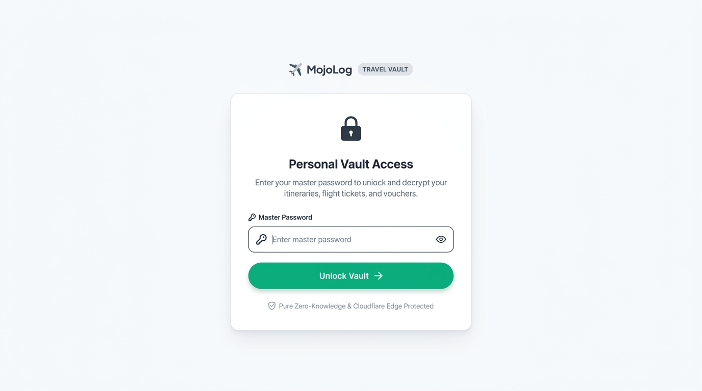
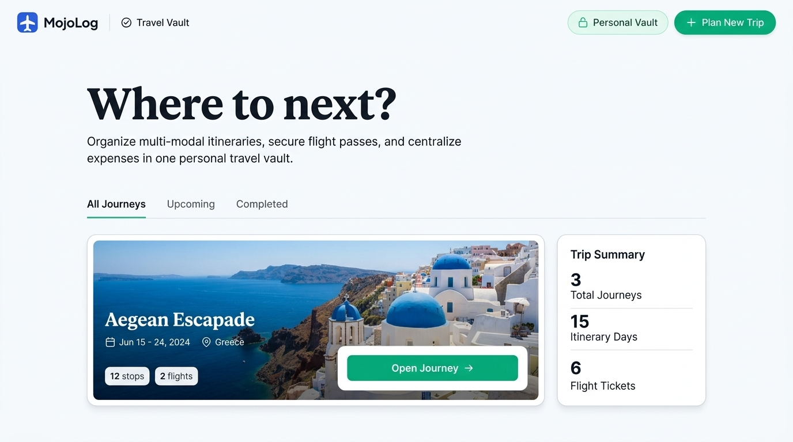
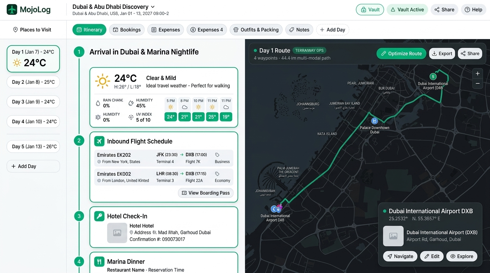

# Redesign Specification: Roammate / Mojolog

## 1. Goals and Problems
**Current Problems:**
- **Inconsistent Typography:** The application mixes `Arial` inside buttons with the brand font `Plus Jakarta Sans`.
- **Accessibility Violations:** The Vault screen uses an `<h2>` without an `<h1>`. The Dashboard jumps from `<h1>` to `<h3>` in the empty state.
- **Low Contrast UI Elements:** The primary action button uses a dark green text (`#065f46`) on a very faint green background (`rgba(16, 185, 129, 0.08)`), which risks failing WCAG contrast requirements on certain monitors.
- **Missing Interaction States:** Buttons lack defined hover, focus, and active visual states.
- **Semantic Structure:** Missing `<nav>` element for main navigation.

**Redesign Goals:**
- Standardize all typography to `Plus Jakarta Sans`.
- Enforce strict WCAG 2.2 AA compliance for contrast and heading hierarchy.
- Introduce a high-contrast, scalable design token system using CSS variables.
- Define explicit interaction states (hover, focus, active, disabled) for all interactive components.

## 2. Users and Key Tasks
**Primary User:** Independent travelers and trip planners.
**Key Tasks:**
1. Unlock the secure vault using a master passcode.
2. View a dashboard of upcoming, completed, and all journeys.
3. Create a new journey/trip.

## 3. Information Architecture
**Sitemap:**
1. `/` (Vault Barrier) -> Auth Modal
2. `/dashboard` (Main App View)
   - Tabs: All Journeys | Upcoming | Completed
   - Actions: Create Trip, Lock Vault

**Navigation Structure:**
- **Top Header (`<header>`):** App logo (left), Vault Status / Lock action (right).
- **Page Context (`<nav>`):** Journey filtering tabs situated directly below the main page `<h1>`.

## 4. Design System

### Colors
- **Brand Primary:** `#10b981` (emerald-500). Use for active tab borders, primary action button backgrounds.
- **Brand Primary Hover:** `#059669` (emerald-600).
- **Brand Primary Active:** `#047857` (emerald-700).
- **Background Base:** `#f8fafc` (slate-50). Use for the `<body>` background.
- **Surface Base:** `#ffffff`. Use for cards and modals.
- **Text Primary:** `#0f172a` (slate-900). Use for headings and primary body text.
- **Text Secondary:** `#64748b` (slate-500). Use for subtitles and empty state descriptions.
- **Text Inverse:** `#ffffff`. Use for text inside Brand Primary buttons.
- **Border Default:** `#e2e8f0` (slate-200).
- **Focus Ring:** `#3b82f6` (blue-500).

### Typography
- **Font Family:** `"Plus Jakarta Sans", Inter, -apple-system, sans-serif`
- **H1:** 28px size, 42px line-height, 800 weight, Text Primary color.
- **H2:** 22px size, 33px line-height, 700 weight, Text Primary color.
- **H3:** 18px size, 27px line-height, 600 weight, Text Primary color.
- **Body:** 16px size, 24px line-height, 400 weight, Text Primary color.
- **Body Small:** 14px size, 21px line-height, 400 weight, Text Secondary color.
- **Button Text:** 14px size, 21px line-height, 600 weight.

### Spacing & Grid
- **Base Unit:** 4px
- **Scale:** 4px, 8px, 12px, 16px, 24px, 32px, 48px, 64px
- **Page Max-Width:** 1200px, centered (`margin: 0 auto`), with 24px horizontal padding on desktop.

### Radii & Shadows
- **Radius Small:** 4px (checkboxes)
- **Radius Medium:** 8px (cards, inputs)
- **Radius Pill:** 9999px (buttons, badges)
- **Shadow Modal:** `0px 10px 25px -5px rgba(0, 0, 0, 0.1), 0px 8px 10px -6px rgba(0, 0, 0, 0.1)`
- **Shadow Card:** `0px 1px 3px 0px rgba(0, 0, 0, 0.1), 0px 1px 2px -1px rgba(0, 0, 0, 0.1)`

## 5. Page-by-Page Spec

### Page: Vault Auth Modal (`/`)
*Reference: `../screenshots/home_1440px.png`*
- **Background:** `#f8fafc` taking 100vw and 100vh.
- **Modal Surface:** `#ffffff` background, Radius Medium (8px), Shadow Modal. 400px fixed width. Centered horizontally and vertically using Flexbox (`align-items: center`, `justify-content: center`).
- **Content Flow (Top to Bottom):**
  - **Icon:** Lock icon, 24px size, `#0f172a`, centered, 24px bottom margin.
  - **H1:** "Personal Vault Access", 22px (mapped to H2 visually but coded as H1), centered, 8px bottom margin.
  - **P:** "Enter your master password...", Body Small, centered, 24px bottom margin.
  - **Input Field:** 100% width, 44px height, 16px padding left/right, Border Default, Radius Medium.
  - **Submit Button:** Primary Button variant, 100% width, 44px height, 16px top margin.

### Page: Main Dashboard (`/dashboard`)
*Reference: `../screenshots/app_1440px.png`*
- **Background:** `#f8fafc`.
- **Top Header:** 64px height, 100% width, `#ffffff` background, `0px 1px 0px 0px #e2e8f0` border-bottom.
  - Left: Logo text "Roammate", 16px, 700 weight, `#0f172a`.
  - Right: Secondary Button "Personal Vault" (left icon: Lock 14px), 16px gap to Logo.
- **Main Content Container:** `max-width: 1200px`, `margin: 32px auto 0`, `padding: 0 24px`.
- **Hero Section:**
  - **H1:** "Where to next?", 24px bottom margin.
- **Tabs `<nav>`:**
  - Flex container, `gap: 24px`, 32px bottom margin, `border-bottom: 1px solid #e2e8f0`.
  - Tab Items: "All Journeys", "Upcoming", "Completed". 
- **Empty State (if 0 journeys):**
  - Flex container, `flex-direction: column`, `align-items: center`, `padding: 64px 0`.
  - **H2:** "No journeys found" (fix from H3), 8px bottom margin.
  - **P:** "Plan your next adventure...", Body Small, 24px bottom margin.
  - **Action:** Primary Button "Create Your First Trip".

## 6. Component Library

### Button: Primary
- **Default:** Background `#10b981`, Text `#ffffff`, Radius 9999px, Padding 10px 20px, Font size 14px, Weight 600.
- **Hover:** Background `#059669`, cursor `pointer`.
- **Active:** Background `#047857`, transform `scale(0.98)`.
- **Focus:** Outline `2px solid #3b82f6`, Outline offset `2px`.
- **Disabled:** Background `#e2e8f0`, Text `#94a3b8`, cursor `not-allowed`, opacity `0.7`.
- **Loading:** Same as Disabled, but replace text with a 16px rotating spinner icon and text "Loading...".

### Button: Secondary
- **Default:** Background `transparent`, Border `1px solid #e2e8f0`, Text `#0f172a`, Radius 9999px, Padding 10px 20px, Font size 14px, Weight 600.
- **Hover:** Background `#f1f5f9`.
- **Active:** Background `#e2e8f0`.
- **Focus:** Outline `2px solid #3b82f6`, Outline offset `2px`.
- **Disabled:** Border `#e2e8f0`, Text `#94a3b8`, cursor `not-allowed`.

### Input: Text / Password
- **Default:** Background `#ffffff`, Border `1px solid #e2e8f0`, Text `#0f172a`, Radius 8px, Height 44px, Padding 0 16px, Font size 16px.
- **Hover:** Border `#cbd5e1`.
- **Focus:** Border `#3b82f6`, Box-shadow `0 0 0 3px rgba(59, 130, 246, 0.1)`, Outline `none`.
- **Error:** Border `#ef4444`.
- **Disabled:** Background `#f1f5f9`, Text `#94a3b8`, cursor `not-allowed`.

### Tabs
- **Default (Unselected):** Text `#64748b`, Font size 14px, Weight 500, Padding 0 0 12px 0, Border-bottom `2px solid transparent`.
- **Hover (Unselected):** Text `#0f172a`, Border-bottom `2px solid #cbd5e1`.
- **Active (Selected):** Text `#10b981`, Weight 600, Border-bottom `2px solid #10b981`.
- **Focus:** Outline `2px solid #3b82f6`, Outline offset `4px`, Radius 4px (applied only on keyboard focus).

## 7. Interactions and Motion

- **Button Hover/Focus Transition:** `background-color 150ms ease-in-out, border-color 150ms ease-in-out, box-shadow 150ms ease-in-out`.
- **Button Active (Press):** `transform 100ms cubic-bezier(0.4, 0, 0.2, 1)`.
- **Modal Open:** `opacity 200ms ease-out` (from 0 to 1), `transform 200ms ease-out` (from `translateY(10px)` to `translateY(0)`).
- **Tab Switch:** `border-color 150ms ease-in-out, color 150ms ease-in-out`. No layout animation for tab content.

## 8. Responsive Behavior

### Breakpoints
- **Mobile (Default):** < 768px (`../screenshots/home_375px.png`)
- **Tablet:** >= 768px and < 1024px (`../screenshots/home_768px.png`)
- **Desktop:** >= 1024px (`../screenshots/home_1440px.png`)

### Mobile Specific Rules (< 768px)
- **Page Container Padding:** Reduce from 24px to 16px.
- **Typography:**
  - H1 scales down to 24px size, 32px line-height.
  - H2 scales down to 20px size, 28px line-height.
- **Dashboard Tabs:** Enable `overflow-x: auto` on the `<nav>` container, hide scrollbars (`scrollbar-width: none`), allow items to scroll horizontally without wrapping (`white-space: nowrap`).
- **Vault Modal:** Width changes from `400px` to `calc(100vw - 32px)`.

## 9. Accessibility Rules

- **Contrast:** Ensure `#10b981` with `#ffffff` text is checked. If it fails 4.5:1, shift Brand Primary to `#059669`.
- **Focus States:** Every interactive element MUST have a `:focus-visible` state utilizing the `#3b82f6` focus ring.
- **Headings:** The page must contain exactly one `<h1>`. No heading levels may be skipped (e.g., jumping from `<h1>` to `<h3>` is prohibited).
- **Aria Labels:** The "Show/Hide Password" eye icon button must use `aria-label="Show password"` or `aria-label="Hide password"` and `aria-expanded` attributes.
- **Target Size:** The eye icon button must have a minimum clickable area of 44x44px, achieved via padding.

## 10. Developer Notes

### Recommended File Structure
```
src/
  components/
    ui/
      Button.tsx
      Input.tsx
      Tabs.tsx
  styles/
    tokens.css
```

### CSS Variables (Design Tokens)
Place this at the top of your global CSS:
```css
:root {
  --color-brand-primary: #10b981;
  --color-brand-hover: #059669;
  --color-brand-active: #047857;
  
  --color-bg-base: #f8fafc;
  --color-surface-base: #ffffff;
  
  --color-text-primary: #0f172a;
  --color-text-secondary: #64748b;
  --color-text-inverse: #ffffff;
  
  --color-border-default: #e2e8f0;
  --color-focus-ring: #3b82f6;

  --font-family-base: "Plus Jakarta Sans", Inter, -apple-system, sans-serif;
  
  --radius-sm: 4px;
  --radius-md: 8px;
  --radius-pill: 9999px;
  
  --shadow-card: 0px 1px 3px 0px rgba(0,0,0,0.1), 0px 1px 2px -1px rgba(0,0,0,0.1);
  --shadow-modal: 0px 10px 25px -5px rgba(0,0,0,0.1), 0px 8px 10px -6px rgba(0,0,0,0.1);
}
```

### Build Order
1. Setup `tokens.css` globally.
2. Build `Button`, `Input`, and `Tabs` base components enforcing the states and styles from Section 6.
3. Refactor the `AuthModal` to use the new `Button` and `Input` components, fixing the H1 semantic issue.
4. Refactor the `Dashboard` hero and tabs, implementing horizontal scroll for mobile.
5. Audit with a screen reader and keyboard navigation to verify focus rings and ARIA labels.

## 11. Visual Mockups

Below are the AI-generated high-fidelity mockups mapping the original design references to our new editorial design system.

### Vault Auth Modal
*(Redesign of `docs/design-reference/01-auth-modal/passcode-auth-modal.png`)*


### Trips Dashboard
*(Redesign of `docs/design-reference/02-trips-list/trips-list-overview.png`)*


### Timeline Itinerary & Map
*(Redesign of `docs/design-reference/03-timeline-itinerary/timeline-full-view.png`)*

